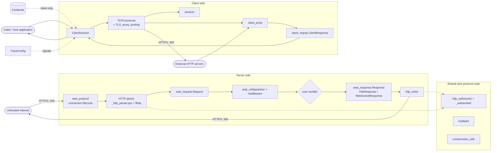
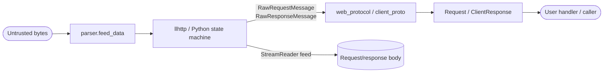
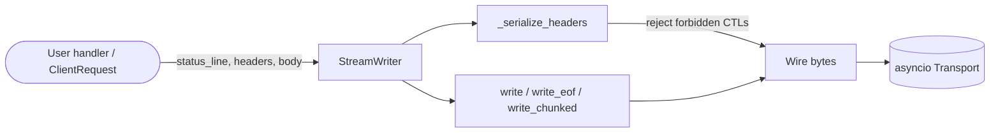
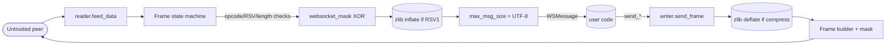
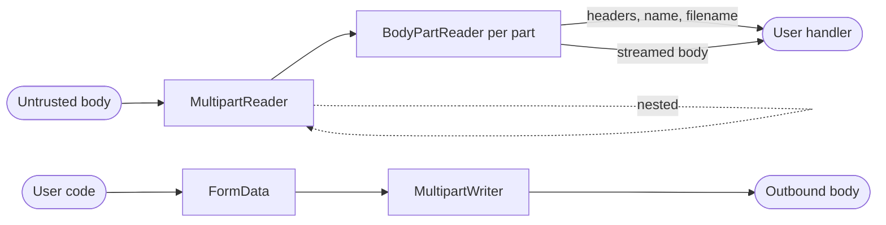

# Threat Model

This document is a STRIDE-based threat model for the
[aiohttp](https://github.com/aio-libs/aiohttp) library. It is a living document
intended to (a) make explicit the implicit security assumptions baked into the
codebase, (b) catalogue known classes of threat against each subsystem, and
(c) record the existing and recommended mitigations.

Some mitigations are expected to be in the application code built on top
of aiohttp. Recommendations addressed to application authors rather than
to aiohttp maintainers are prefixed **User:** to make the responsibility
explicit.

---

## 1. Library Overview

**aiohttp** is an `asyncio`-based HTTP client/server framework for Python. It
provides:

- An **HTTP/1.1 server** (`aiohttp.web`) including routing, middleware,
  WebSocket support, static-file serving, and a Gunicorn worker.
- An **HTTP/1.1 client** (`aiohttp.ClientSession`) including connection
  pooling, TLS, proxy support, redirects, cookie handling, and WebSockets.
- Shared **wire-protocol code**: HTTP/1 parser (vendored
  [llhttp](https://github.com/nodejs/llhttp) wrapped in Cython, with a pure
  Python fallback), HTTP writer, WebSocket framing, multipart, and compression.

Key public APIs (non-exhaustive):

| Surface | Entry points |
| --- | --- |
| Server | `aiohttp.web.Application`, `web.RouteTableDef`, `web.run_app`, `web.AppRunner`, `web.WebSocketResponse`, `web.FileResponse` |
| Client | `aiohttp.ClientSession`, `aiohttp.TCPConnector`, `aiohttp.ClientResponse`, `aiohttp.WSMessage`, `aiohttp.BasicAuth` |
| Shared | `aiohttp.MultipartReader`/`MultipartWriter`, `aiohttp.CookieJar`, `aiohttp.TraceConfig`, `aiohttp.resolver.AsyncResolver` |

---

## 2. Methodology

We use [STRIDE](https://en.wikipedia.org/wiki/STRIDE_model):

- **S**poofing — impersonating identity (host, user, peer, dependency).
- **T**ampering — modifying data or code in flight or at rest.
- **R**epudiation — denying that an action occurred.
- **I**nformation Disclosure — leaking confidential data.
- **D**enial of Service — exhausting CPU, memory, sockets, file descriptors.
- **E**levation of Privilege — gaining unintended access.

Risk is ranked **High / Medium / Low** based on a rough product of likelihood
and impact, as judged by maintainers. Mitigations are split into
**existing** (already implemented in the codebase) and **recommended** (not
yet implemented or only partially implemented).

---

## 3. Overall Assets

These cross-cutting assets apply across most sections; individual sections only
list assets unique to that section.

1. **Integrity of public-API behavior** — functions return what callers expect
   and don't introduce protocol corruption (request smuggling, response
   splitting, framing desync).
2. **Confidentiality of data in transit** — TLS handling, header values,
   cookies, request/response bodies are not leaked between connections,
   sessions, or to log sinks.
3. **Availability of host application** — aiohttp does not crash, deadlock, or
   exhaust CPU/memory/FDs in the host process under hostile or malformed input.
4. **Security of host application** — aiohttp does not become a vector for
   attacks on the embedding application (SSRF, file disclosure, code execution,
   privilege escalation through deserialisation, etc.).
5. **Reputation & supply-chain integrity** — the released artifacts on PyPI are
   what maintainers built and signed; the source on GitHub matches the artifacts;
   the vendored llhttp matches upstream; CI/CD secrets are not exposed.

---

## 4. High-Level System Diagram

---

## 5. Scope

The threat surface is broken down into 19 sections. Each is modeled in its own
subsection below.

1. [HTTP/1 parser](#51-http1-parser)
2. [HTTP/1 writer](#52-http1-writer)
3. [WebSocket framing & per-message deflate](#53-websocket-framing--per-message-deflate)
4. [Multipart parsing & encoding](#54-multipart-parsing--encoding)
5. [Compression codecs](#55-compression-codecs)
6. [Streams & payloads](#56-streams--payloads)
7. [Server connection lifecycle](#57-server-connection-lifecycle)
8. [Server routing & middleware](#58-server-routing--middleware)
9. [Server request/response objects](#59-server-requestresponse-objects)
10. [Server static file serving](#510-server-static-file-serving)
11. [Server-side WebSocket handler](#511-server-side-websocket-handler)
12. [Client API & request lifecycle](#512-client-api--request-lifecycle)
13. [Connector / TLS / proxy / pooling](#513-connector--tls--proxy--pooling)
14. [Client-side WebSocket](#514-client-side-websocket)
15. [Client auth middlewares](#515-client-auth-middlewares)
16. [Cookie handling](#516-cookie-handling)
17. [DNS resolution](#517-dns-resolution)
18. [Tracing & URL/header helpers](#518-tracing--urlheader-helpers)
19. [Build & release supply chain](#519-build--release-supply-chain)

---

### 5.1. HTTP/1 parser

**Scope.** Parsing of HTTP/1.0 and HTTP/1.1 request and response messages —
request/status line, header block, chunked transfer-encoding, content-length
framing, trailers — and the surface where parsed values flow into the rest of
the library. Out of scope here: WebSocket framing ([§5.3](#53-websocket-framing--per-message-deflate)), multipart bodies
([§5.4](#54-multipart-parsing--encoding)), compression ([§5.5](#55-compression-codecs)), HTTP-writer-side framing ([§5.2](#52-http1-writer)).

**Components covered.**

- `aiohttp/_http_parser.pyx` — Cython wrapper over vendored llhttp, default in
  CPython builds.
- `aiohttp/_cparser.pxd` — Cython declarations for llhttp.
- `aiohttp/http_parser.py` — pure-Python `HttpRequestParser` / `HttpResponseParser`
  used as a fallback (and as the canonical implementation when
  `AIOHTTP_NO_EXTENSIONS=1`).
- `aiohttp/_find_header.pxd` / `aiohttp/_find_header.h` — header-name interning.
- `aiohttp/http_exceptions.py` — `BadHttpMessage`, `BadHttpMethod`,
  `BadStatusLine`, `LineTooLong`, `InvalidHeader`, `TransferEncodingError`,
  `ContentLengthError`.
- `vendor/llhttp/` — vendored upstream parser, version `9.3.1` (see
  `vendor/llhttp/package.json`). Generated via `make generate-llhttp`.

**Selection.** A conditional re-import at the bottom of
`aiohttp/http_parser.py` re-binds the public names to the Cython parser when
`_http_parser` imports successfully and `AIOHTTP_NO_EXTENSIONS` is unset. There is no hybrid mode — both request and
response parsers come from the same backend, so an inconsistent
request-Cython/response-pure-Python configuration cannot occur in supported
builds.

**Trust boundaries & data flow.**

The parser is invoked on every byte that arrives from a socket, before any
authentication. **Everything fed into `feed_data` is attacker-controlled** on
the server side and **upstream-controlled** on the client side (proxies,
upstream services, malicious origins reached via client). The output
(`RawRequestMessage` / `RawResponseMessage`, raw header tuples, body chunks
into `StreamReader`) is then handed to `web_protocol.RequestHandler` and
`client_proto.ResponseHandler` respectively.

**Trust assumptions about parser output:**

- Header names are validated against a token regex; values are not normalised
  beyond `lstrip`/`rstrip` and CR/LF/NUL rejection.
- Header values are decoded `utf-8` with `surrogateescape`, so non-UTF-8 bytes
  are *preserved* and *can round-trip back to the wire* if downstream code
  re-emits them. Any sanitisation downstream of the parser is the
  responsibility of consumers (logging, header reflection, proxying).
- Methods are accepted as any RFC 7230 token; the parser does not canonicalise
  case.
- Versions are accepted by the regex `HTTP/(\d)\.(\d)` — i.e. `HTTP/0.9`,
  `HTTP/2.0`, etc. all parse without rejection, even though they cannot be
  served correctly.

**Assets at risk.**

- **Framing integrity** — that one wire message corresponds to one parsed
  message; nothing the parser accepts can cause a desync between aiohttp and
  an upstream/downstream peer (request smuggling).
- **Allocator safety** — that a malicious peer cannot drive memory or CPU
  usage to denial of service through parser-controlled allocations.
- **Bytewise transparency** — that bytes accepted by the parser cannot inject
  new framing or new header semantics downstream (CRLF injection, NUL
  smuggling).

**Threats (STRIDE).**

| # | Component / Vector | STRIDE | Threat | Risk |
| :--- | :--- | :--- | :--- | :--- |
| 1.1 | Request line / status line | T | Smuggling via duplicate / conflicting framing headers (`Content-Length` × N, `Content-Length` + `Transfer-Encoding`, obfuscated `Transfer-Encoding`). | High |
| 1.2 | Header block, line endings | T | Smuggling via bare-LF, obs-fold, optional CR-before-LF on the *request* parser. Request parser is strict; lenient flags apply only to the response parser. | Medium |
| 1.3 | Header values, CR/LF/NUL | T / I | CRLF injection enabling response splitting / header injection if downstream re-emits values verbatim. Historically [CVE-2023-37276](https://github.com/aio-libs/aiohttp/security/advisories/GHSA-45c4-8wx5-qw6w). | High |
| 1.4 | Header values, surrogateescape decode | I / T | Non-UTF-8 bytes round-trip through `Headers` and may be reflected by user code / proxies / logs into untrusted contexts. | Medium |
| 1.5 | HTTP version regex | T | `HTTP/0.9` and `HTTP/2.0` accepted on the wire, opening a small surface for protocol-confusion against intermediaries that handle these specially. | Low |
| 1.6 | Method token | I / T | Methods are not case-canonicalised; arbitrary tokens up to `max_line_size` accepted. May confuse downstream method-based authorisation if user code compares case-sensitively. | Low |
| 1.7 | `Content-Length` parsing | T | Negative or non-decimal CL handling, multiple comma-separated CLs, CL with leading `+`/whitespace. | Medium |
| 1.8 | `Transfer-Encoding: chunked` parsing | T | Lenient acceptance (`xchunked`, `chunked, identity`, doubled `chunked`) leading to smuggling against a non-aiohttp peer that interprets differently. | Medium |
| 1.9 | Chunk size parsing | D | No upper bound on chunk-size value (Python unbounded int); huge chunk size could drive allocator before `client_max_size` rejects body. Mitigated by [§5.7](#57-server-connection-lifecycle) / `client_max_size`. | Low–Med |
| 1.10 | Chunk extensions | D / T | Unbounded chunk-extension consumption per chunk; weak validation of extension syntax. | Low |
| 1.11 | Parser error reporting | I | Exception messages may include up to ~100 bytes of malformed input, which can be surfaced in 4xx error bodies, logs, or `DEBUG=True` traces. | Low |
| 1.12 | Cython ⇄ pure-Python divergence | T / S | Behaviour differences between llhttp and the Python fallback may produce parser-confusion if a deployment unintentionally switches backends (e.g. a user installs without compiled extensions). | Med |
| 1.13 | Vendored llhttp version drift | S / T | An upstream llhttp CVE not picked up by aiohttp's vendoring cadence remains exploitable until `make generate-llhttp` is re-run and released. | Medium |
| 1.14 | Build/regen of llhttp (`make generate-llhttp`) | S / T | Local tampering or supply-chain compromise of the npm `llhttp` package gets baked into the vendored C. Covered in [§5.19](#519-build--release-supply-chain) but originates here. | Medium |

**Mitigations.**

| # | Threat | Existing | Recommended |
| :--- | :--- | :--- | :--- |
| 1.1 | Smuggling via duplicate framing headers | llhttp rejects conflicting `Content-Length`. `http_parser.py:HttpRequestParserPy.parse_headers` rejects coexistence of CL + `Transfer-Encoding: chunked`. The full `SINGLETON_HEADERS` set (CL, CT, Host, TE, ETag, etc.) is duplicate-rejected by the request parser (strict mode); `#12302` disabled this check on the response parser (lax mode), since real-world servers commonly send duplicate `Content-Type` / `Server`. | If new singleton-sensitive headers emerge in HTTP/1.1 RFC errata, add to `SINGLETON_HEADERS`. |
| 1.2 | Lenient response parsing | Lenient flags (`llhttp_set_lenient_headers`, `llhttp_set_lenient_optional_cr_before_lf`, `llhttp_set_lenient_spaces_after_chunk_size`) are only enabled on the **response** parser and only when `DEBUG` is False (set in `HttpResponseParser.__init__`). The **request** parser is strict. | Documented design decision: keep lenient response parsing for real-world server interop |
| 1.3 | CRLF / NUL in header values | Bytes `\r`, `\n`, `\x00` rejected in header values (`_http_parser.pyx` callbacks; `http_parser.py:HeadersParser.parse_headers`). | Keep regression tests in `tests/test_http_parser.py` covering each forbidden byte both in name and value, and across both Cython and pure-Python parsers. |
| 1.4 | Non-UTF-8 round-trip | None at parser layer (intentional — preserving original bytes is required for some use cases). | **Document in user-facing docs that header values are bytes-preserving.** **User**: Re-validate any header value before reflecting it into responses, logs, or sub-requests. |
| 1.5 | HTTP version regex accepts 0.9 / 2.0 | None (regex is permissive). | **Tighten `VERSRE` (and llhttp configuration if possible) to reject anything outside `HTTP/1.0` and `HTTP/1.1`.** |
| 1.6 | Method-case round-trip | Method token validated by regex; not canonicalised. | **Document the asymmetry.** **User**: Compare HTTP methods case-sensitively to canonical RFC tokens, or use `web.RouteTableDef` decorators (which already match canonical methods). |
| 1.7 | `Content-Length` parsing | llhttp validates CL is decimal and non-negative; pure-Python parser validates via `DIGITS.fullmatch(r"\d+")` before `int(...)`, rejecting `+`/`-`/non-ASCII-digit forms (`test_bad_headers`, `test_headers_content_length_err_*` cover these). | None. Cross-backend parity is covered by the shared parser tests. |
| 1.8 | `Transfer-Encoding` lenience | `_is_chunked_te` requires `chunked` to be the last value; duplicate `chunked` rejected (`#10611`). Request parser strict. | None. |
| 1.9 | Chunk-size DoS | The parser doesn't cap chunk size, but **server-side body length is bounded by `client_max_size` (default `1 MiB`)** in `web_request.py:BaseRequest.read`. Client-side responses are bounded by user-supplied `max_body_size` / streaming reads. | None. If a cap is ever needed at the parser level, plumb it through `HttpPayloadParser`. |
| 1.10 | Chunk-extension DoS | Chunk-extension content is bounded by the same wire-level size constraints (it shares the chunk-size line with `max_line_size`). | **Add an explicit test that chunk-extension flooding cannot blow past `max_line_size`.** |
| 1.11 | Parser error reflection | `http_parser.py` truncates to `[:100]` for line errors. Server-side error path renders 4xx with the exception message; tracebacks only when `DEBUG=True`. | **Audit any aiohttp path where `BadHttpMessage` content is reflected to the client unsanitised.** **User**: Review custom `web_log` configurations and any middleware that reflects parser exception messages back to the peer. |
| 1.12 | Cython ⇄ pure-Python divergence | `tests/test_http_parser.py` parameterises tests over `REQUEST_PARSERS` / `RESPONSE_PARSERS` (pure-Python always; Cython when the extension imports). The high-leverage attack vectors are already covered under both backends: CL+TE (`test_content_length_transfer_encoding`), CL×N (`test_duplicate_singleton_header_rejected`), obs-fold (`test_reject_obsolete_line_folding`, `test_http_response_parser_obs_line_folding*`), CR/LF/NUL (`test_bad_headers`, `test_http_response_parser_null_byte_in_header_value`, `test_http_response_parser_bad_crlf`), version regex (`test_http_request_parser_bad_version*`, `test_http_response_parser_bad_version*`). | None. When new attack vectors emerge, add them to the parameterised tests. |
| 1.13 | llhttp version drift | Manual upgrade via `make generate-llhttp`; vendor pinned in `vendor/llhttp/package.json`. | Track upstream releases (e.g. via Dependabot rule for `vendor/llhttp/package.json`), bump on every llhttp release, regenerate in CI. |
| 1.14 | npm-side compromise of `llhttp` | The vendored output is checked into git, so a compromise during a future regen would be detectable in PR review. See [§5.19](#519-build--release-supply-chain). | **Make the llhttp build reproducible: pin Node.js version, commit the npm lockfile, and on every bump verify the regenerated C against upstream's release tarballs before committing.** |

**Past advisories / hardening (recap).**

- **GHSA-xx9p-xxvh-7g8j (CVE-2023-47641)** (3.8.0) — CL-vs-TE divergence
  between the Cython and pure-Python parsers, allowing request smuggling
  against deployments that switched backends.
- **GHSA-45c4-8wx5-qw6w (CVE-2023-37276)** (3.8.5) — HTTP request smuggling
  via CR/LF/NUL in header values. Both parsers reject these bytes at the
  byte level.
- **GHSA-pjjw-qhg8-p2p9** (3.8.6) — smuggling pair in vendored llhttp 8.1.1;
  fixed by bumping llhttp to 9.
- **GHSA-gfw2-4jvh-wgfg (CVE-2023-47627) / GHSA-8qpw-xqxj-h4r2 (CVE-2024-23829)** (3.8.6 / 3.9.2) — pure-Python
  parser accepted lenient separators / weak RFC validation that llhttp
  rejected.
- **GHSA-8495-4g3g-x7pr (CVE-2024-52304)** (3.10.11) — chunk-extension
  newline smuggling in the pure-Python parser.
- **GHSA-9548-qrrj-x5pj (CVE-2025-53643)** (3.12.14) — request smuggling
  via the chunked-trailer section in the pure-Python parser.
- **GHSA-69f9-5gxw-wvc2 (CVE-2025-69224)** (3.13.3) — Unicode codepoints
  matched by `\d` in the pure-Python parser's regexes were treated as
  digits.
- **GHSA-g84x-mcqj-x9qq (CVE-2025-69229)** (3.13.3) — CPU-DoS on `request.read()` when
  the body arrives as a very large number of small chunks.
- **PR #12137** (3.13.4) — precautionary hardening: pure-Python parser
  now explicitly rejects duplicate `Transfer-Encoding: chunked` on
  the request parser.
- **GHSA-c427-h43c-vf67 (CVE-2026-34525)** (3.13.4) — duplicate `Host` header accepted
  in request parser, bypassing `Application.add_domain()` host-based
  routing / authorisation. Fixed by adding `Host` to the strict
  request-parser singleton rejection set.
- **GHSA-63hf-3vf5-4wqf (CVE-2026-34520)** (3.13.4) — llhttp accepted
  NUL / control bytes in *response* header values, leaving the response
  parser weaker than the request parser. Fixed by tightening the
  response-side byte check.
- **GHSA-w2fm-2cpv-w7v5 (CVE-2026-22815)** (3.13.4) — uncapped memory
  growth on long header / trailer blocks. Fixed by enforcing
  `max_field_size` / `max_headers` on the trailer block too.
- **PR #12302** (3.13.5) — duplicate-singleton-header rejection
  was breaking real-world response parsing (servers like Google APIs /
  Werkzeug emit duplicate `Content-Type` / `Server`); fix disables the
  check on the response parser (lax mode) while keeping it on the
  request parser (strict).
- **GHSA-63hw-fmq6-xxg2 (CVE-2026-54277)** (3.14.1) — the
  Cython / llhttp request parser failed to enforce `max_line_size`
  when a single request or header line arrived across multiple TCP
  segments, letting an attacker stream an oversized line in small
  fragments to exhaust memory.
- **GHSA-4fvr-rgm6-gqmc (CVE-2026-54273)** (3.14.1) — no cap
  on the number of HTTP/1 pipelined requests queued on a single
  connection; the `_messages` deque in `web_protocol.RequestHandler`
  could grow without bound. Memory was previously bounded only
  transitively by `read_bufsize` ([§5.7](#57-server-connection-lifecycle) threat 7.4);
  the fix adds an explicit pipeline-count cap.

These are all currently in place; this section assumes no regression.

---

### 5.2. HTTP/1 writer

**Scope.** Serialisation of outbound HTTP/1.x messages — request lines, status
lines, header blocks, chunked / fixed-length / EOF-terminated bodies, drain /
backpressure behaviour. Both server-side response emission and client-side
request emission share the same `StreamWriter`. Out of scope: WebSocket frame
emission ([§5.3](#53-websocket-framing--per-message-deflate)), payload generation for multipart ([§5.4](#54-multipart-parsing--encoding)), compression codecs
([§5.5](#55-compression-codecs)), the user-handler-facing parts of `web.Response` and
`ClientRequest` (covered in [§5.9](#59-server-requestresponse-objects) and [§5.12](#512-client-api--request-lifecycle) respectively, but
called out where the writer's safety depends on them).

**Components covered.**

- `aiohttp/_http_writer.pyx` — Cython `_serialize_headers` and
  `_write_str_raise_on_nlcr` (the forbidden-CTL bytewise rejector: rejects
  `0x00-0x08`, `0x0A-0x1F`, `0x7F`; HTAB and SP remain permitted).
- `aiohttp/http_writer.py` — `StreamWriter` (the `AbstractStreamWriter`
  implementation) plus the pure-Python `_py_serialize_headers` /
  `_safe_header` fallback and the Cython/pure-Python switch at
  `http_writer.py:_py_serialize_headers`.
- `aiohttp/abc.py` — `AbstractStreamWriter` interface.
- Header-source feeders: `aiohttp/web_response.py` (server),
  `aiohttp/client_reqrep.py` (client), `aiohttp/helpers.py:populate_with_cookies`.

**Selection.** `_serialize_headers` defaults to the pure-Python
implementation; if `_http_writer` (Cython) imports successfully and
`AIOHTTP_NO_EXTENSIONS` is unset, the Cython implementation replaces it
(`http_writer.py:_py_serialize_headers`). Both implementations apply the same
RFC 9110 §5.5 / RFC 9112 §4 forbidden-CTL rejection (`0x00-0x08`,
`0x0A-0x1F`, `0x7F`; HTAB and SP permitted) on names *and* values *and*
the status/request line.

**Trust boundaries & data flow.**

The writer's input is **trusted** in the threat-model sense — i.e., it comes
from in-process Python code that ran the user's handler or constructed the
client request. The writer's job is therefore **structural integrity**: ensure
that whatever bytes a handler attempts to emit cannot escape the framing of a
single HTTP message and inject new headers, new status lines, or new requests
on the wire. The wire-side consumer is the **untrusted** counterparty
(arbitrary peer or intermediary).

**Assets at risk (chunk-specific).**

- **Outbound framing integrity** — one logical message ↔ one well-framed wire
  message; no smuggling on the egress side.
- **Header integrity** — no name/value can introduce additional headers,
  status lines, or chunk markers.
- **Liveness of the connection** — a slow / hostile reader cannot drive the
  server (or client) into unbounded memory growth via writer buffering.

**Threats (STRIDE).**

| # | Component / Vector | STRIDE | Threat | Risk |
| :--- | :--- | :--- | :--- | :--- |
| 2.1 | Header name/value with forbidden CTL | T / I | Response-splitting / header injection (CR / LF) or non-RFC-compliant CTLs (`0x01-0x08`, `0x0B-0x1F`, `0x7F`) that downstream agents historically treat inconsistently. | High |
| 2.2 | Status-line `reason` with CR / LF | T | Same family as 2.1 but on the status line; could let an attacker-controlled reason inject a body or a second status line. | High |
| 2.3 | Request-line path/method | T | Path-side smuggling via forbidden CTLs or whitespace inside the path the writer emits. | Medium |
| 2.4 | `Content-Length` ≠ actual body length | T | If a handler / ClientRequest emits a body whose length disagrees with declared `Content-Length`, an intermediary may interpret framing differently from the writer's peer (smuggling). | Medium |
| 2.5 | `Content-Length` *and* `Transfer-Encoding: chunked` | T | Both headers reach the wire if user code constructs them via the raw headers dict; intermediaries disagree on which wins. | Medium |
| 2.6 | Body emission on HEAD / 1xx / 204 / 304 | T | Writer strips CL/TE for empty-body responses but **does not block the application from writing a body**; bytes after the `\r\n\r\n` confuse the next pipelined request. | Medium |
| 2.7 | `Set-Cookie` / `Cookie` value | T | Cookie name or value containing forbidden CTLs passes through `SimpleCookie.output()` unchanged; only caught by writer's header validation. | Medium |
| 2.8 | Compression / `Content-Encoding` | T | Body double-compression when user sets `Content-Encoding` manually and also enables `compress=...`. Intermediaries may reject or mis-decode a doubly-compressed body. | Low |
| 2.9 | Drain / backpressure on slow readers | D | Slow consumer (or `Sec-WebSocket-Key`-style hold) keeps `transport.write()` queued; writer drains at 64 KiB threshold (`http_writer.py:StreamWriter.write`). A handler that doesn't await `drain()` can blow up. | Medium |
| 2.10 | Single oversized chunk | D | `write(b)` with a multi-GB blob is handed straight to `transport.write`; memory pressure shifts to asyncio's buffer. | Low |
| 2.11 | Chunked encoding hex framing | T | Malformed chunk-size lines (negative values, leading-`+`, leading zeros, hex obfuscation) would let a non-aiohttp peer reframe the body differently and smuggle. | Low |
| 2.12 | Header insertion validation timing | T | Forbidden-CTL rejection is *write-time*, not *insert-time*. A handler that sets a malicious header and then aborts before `write_headers()` will not raise. (Documented; not a recommended change.) | Low |
| 2.13 | Cython ⇄ pure-Python parity | T | Divergence between the two `_serialize_headers` implementations could let one backend silently pass a forbidden CTL that the other rejects, weakening egress safety asymmetrically. | Low |
| 2.14 | Trailers asymmetry | T | The writer never emits trailers, but the parser accepts incoming trailers; not a writer-side threat in itself, just a documentation point for completeness. | Low |

**Mitigations.**

| # | Threat | Existing | Recommended |
| :--- | :--- | :--- | :--- |
| 2.1 | Header forbidden-CTL injection | Both backends reject the full RFC 9110 §5.5 / RFC 9112 §4 forbidden set (`0x00-0x08`, `0x0A-0x1F`, `0x7F`; HTAB and SP permitted) via `_write_str_raise_on_nlcr` (`_http_writer.pyx:_write_str_raise_on_nlcr`) and `_safe_header` (`http_writer.py:_safe_header`), raising `ValueError` from `_serialize_headers` before any byte hits the transport. Applied symmetrically to names, values, and the status line. | **The current tests import whichever `_serialize_headers` won the import, so only one backend is exercised. Parameterise like `tests/test_http_parser.py` does (cross-cuts [§6.1](#61-highest-leverage-recommendations) #3).** |
| 2.2 | Status-line `reason` injection | `web_response.Response._set_status` (`web_response.py:StreamResponse._set_status`) rejects `\r` / `\n` in `reason` *at set-time*. The writer also rejects the full forbidden-CTL set at write-time as part of the status-line validation. | None. |
| 2.3 | Request-line path / method | The full status line (`{method} {path} HTTP/{v}.{v}`) goes through `_write_str_raise_on_nlcr` / `_safe_header`, so forbidden CTLs are caught regardless of whether `path` came from `yarl` or `method` was a caller-supplied string. yarl additionally rejects CR/LF/NUL earlier per RFC 3986. | None. |
| 2.4 | CL / body-length mismatch | None at write-time. `web.Response.write_eof` and the chunked writer write what they're given. | **Recommended hardening: in DEBUG mode, assert / warn when actual bytes-written disagrees with declared `Content-Length` at `write_eof()`. Useful for catching smuggling-adjacent bugs in user handlers.** |
| 2.5 | CL + TE simultaneous | Server-side `enable_chunked_encoding()` (`web_response.py:StreamResponse.enable_chunked_encoding`) raises if `Content-Length` is already set; client-side `_update_transfer_encoding()` (`client_reqrep.py:ClientRequest._update_transfer_encoding`) raises if user sets `chunked=True` while `Content-Length` is in headers. Manual user injection into the raw headers dict is *not* caught. | **Consider a write-time assert in `StreamWriter` that rejects `Content-Length` and `Transfer-Encoding: chunked` coexisting.** |
| 2.6 | Body-suppression edge cases | `web_response.py:StreamResponse._prepare_headers` strips `Content-Length` and `Transfer-Encoding` for HEAD / 1xx / 204 / 304 (`EMPTY_BODY_STATUS_CODES`, `helpers.py:EMPTY_BODY_METHODS`). The framework's own machinery doesn't write a body for these. | **User**: Do not call `resp.write(...)` in a handler responding HEAD / 1xx / 204 / 304 — framing strips CL / TE but does not block the byte write. **Optional aiohttp change: have `StreamWriter` short-circuit body writes when `length == 0` and the response was framed as empty-body.** |
| 2.7 | Cookie injection | `populate_with_cookies` (`helpers.py:populate_with_cookies`) routes the cookie through `SimpleCookie.output()` and then into a regular header, where the forbidden-CTL check at write-time catches anything `SimpleCookie` happened to pass through. | Documented design decision: rely on writer-level validation rather than tightening `set_cookie` / `populate_with_cookies` further. Keep regression tests covering cookie name/value with forbidden CTLs across both backends. |
| 2.8 | Manual `Content-Encoding` | Server side: `enable_compression()` (`web_response.py:StreamResponse.enable_compression`) returns early if `Content-Encoding` already present, so the body is not double-compressed. Client side: `ClientRequest._update_content_encoding` raises `ValueError("compress can not be set if Content-Encoding header is set")` — symmetric guard. | None. |
| 2.9 | Drain / backpressure | `StreamWriter.write` drains at `LIMIT = 0x10000` bytes (`http_writer.py:StreamWriter.write`) when `drain=True` is set by the caller. Application code is expected to `await write(...)` to honour backpressure. | **User**: `await write(...)` in handlers; tight `for` loops without `await` can starve the event loop. Cross-reference [§5.7](#57-server-connection-lifecycle) for connection-level read/write timeouts that mitigate slow consumers. |
| 2.10 | Oversized single chunk | None at the writer layer — bytes go straight to `transport.write`. asyncio applies its own high-water marks via the transport. | **User**: Relies on application-level bounds (use streaming, generators, `FileResponse`, etc., for large bodies). |
| 2.11 | Chunked hex framing | The writer always uses `f"{len(chunk):x}\r\n"` followed by the chunk and `\r\n` (`http_writer.py:StreamWriter._write_chunked_payload`). | None. |
| 2.12 | Insert-time vs write-time validation | Headers are validated at write-time only; `set_status` validates `reason` at set-time. | Documented design decision: late validation is acceptable; keep behaviour as-is. |
| 2.13 | Cython ⇄ pure-Python parity | Both backends share the same logic and test surface; the Cython version uses a fast per-codepoint range check (`ch < 0x20 and ch != 0x09`, plus `0x7F`), the Python version uses a precompiled `re` over the same forbidden set. | **Parameterise the writer tests over both backends so egress equivalence on malicious inputs is exercised under both (see [§6.1](#61-highest-leverage-recommendations) #3).** |
| 2.14 | Trailers asymmetry | Writer does not emit trailers; parser accepts trailers on incoming. Documented for completeness. | None. |

**Past advisories / hardening (recap).**

- **GHSA-q3qx-c6g2-7pw2 (CVE-2023-49081)** (3.9.0) — `ClientSession`
  CRLF injection via the HTTP `version` argument.
- **GHSA-qvrw-v9rv-5rjx (CVE-2023-49082)** (3.9.0) — `ClientSession` CRLF injection via
  the `method` argument (request-line injection).
- **GHSA-mwh4-6h8g-pg8w (CVE-2026-34519)** (3.13.4) — response-splitting via `\r` in
  the status-line `reason`. Fixed by rejecting CR/LF in `reason` at
  `_set_status` set-time, on top of the existing writer-side check
  (threat 2.2).
- **[#12689](https://github.com/aio-libs/aiohttp/pull/12689)** (hardening, no
  CVE) — outbound header serialization only rejected CR/LF/NUL; other
  RFC 9110 §5.5 / RFC 9112 §4 forbidden CTLs (`0x01-0x08`, `0x0B-0x1F`,
  `0x7F`) could be emitted on the wire if a handler placed them into a
  header. Tightened `_safe_header` and `_write_str_raise_on_nlcr` to
  reject the full forbidden set (threat 2.1).

Writer-level forbidden-CTL rejection via `_safe_header` and
`_write_str_raise_on_nlcr` has been in place since the header-injection
family of issues was first surfaced (well before CVE-2023-37276, which
was a parser-side fix); the rejected set was broadened from
{CR, LF, NUL} to the full RFC 9110 forbidden set in
[#12689](https://github.com/aio-libs/aiohttp/pull/12689).

---

### 5.3. WebSocket framing & per-message deflate

**Scope.** RFC 6455 frame parsing and serialisation, masking, fragmentation
and continuation, control frames (close / ping / pong), and the
permessage-deflate (PMCE; RFC 7692) extension. Both server-side
(`web_ws.WebSocketResponse`) and client-side (`client_ws.ClientWebSocketResponse`)
share this layer. Out of scope: the WebSocket *handshake* and per-side
lifecycle (covered in [§5.11](#511-server-side-websocket-handler) server, [§5.14](#514-client-side-websocket) client) and the underlying
compression codecs themselves ([§5.5](#55-compression-codecs)).

**Components covered.**

- `aiohttp/http_websocket.py` — public re-export shim.
- `aiohttp/_websocket/`:
  - `mask.pyx` / `mask.pxd` — Cython SIMD-style XOR.
  - `helpers.py` — pure-Python masking fallback (`bytearray.translate`),
    extension parameter parsing (`ws_ext_parse`), close-code unpacking.
  - `models.py` — `WSCloseCode`, `WSMsgType`, message dataclasses.
  - `reader.py` / `reader_c.pyx` / `reader_c.py` / `reader_py.py` — frame
    reader (Cython preferred, pure-Python fallback).
  - `writer.py` — frame writer.
  - `__init__.py`.

**Selection.** The reader's import dance (`reader.py`) prefers
`reader_c` (Cython) and falls back to `reader_py` on `ImportError`. Both
implementations apply the same validation rules.

**Trust boundaries & data flow.**

The reader's input is fully attacker-controlled. Output (`WSMessage` with
`data`, `extra`, `type`) is consumed by user handler code. Server-side, mask
bytes from the peer's frames are XORed before reaching the application;
client-side, the writer adds masks to outgoing frames.

**Assets at risk (chunk-specific).**

- **Frame integrity** — opcode, RSV bits, FIN, length, mask all parsed
  consistently; no path can let a peer smuggle a control frame inside a data
  frame or coerce the reader into accepting a malformed frame.
- **Decompression safety** — PMCE-compressed frames cannot drive memory or
  CPU to denial of service via a small input expanding to a huge output.
- **Memory bounds across messages** — a peer holding the connection open and
  drip-feeding fragments cannot grow memory unboundedly.

**Threats (STRIDE).**

| # | Component / Vector | STRIDE | Threat | Risk |
| :--- | :--- | :--- | :--- | :--- |
| 3.1 | Server reader accepting unmasked client frames | T / S | The reader does not enforce RFC 6455 §5.1 ("server MUST fail on unmasked client frame"). A non-conformant or malicious client can send unmasked frames; the spec rationale is preventing cache-poisoning of intermediaries. | Medium |
| 3.2 | Mask key generation | I | Outbound masks come from `random.getrandbits(32)` (`writer.py:WebSocketWriter.__init__`), not `secrets`. RFC 6455 §5.3 says masks must be "unpredictable"; PRNG is not cryptographic. | Low |
| 3.3 | Reserved bits (RSV1/2/3) | T | RSV2/3 always rejected; RSV1 only allowed when PMCE is negotiated (`reader_py.py:WebSocketReader._feed_data`). Misalignment between negotiation state and frame would let a peer toggle decompression. | Low |
| 3.4 | Unknown opcode | T | Peer-controlled opcode outside the defined range (`0x0`–`0xA`) could route to an unexpected handler path if accepted. | Low |
| 3.5 | Control-frame size > 125 bytes | T | Oversized control frame would violate RFC 6455 framing and could mis-frame against a non-aiohttp peer. | Low |
| 3.6 | Fragmented control frame (FIN=0) | T | Fragmented control frame is a protocol violation; accepting one would let a peer interleave control state across the fragment sequence. | Low |
| 3.7 | Continuation without preceding text/binary | T | Continuation frame without an initial data frame leaves assembly state ambiguous. | Low |
| 3.8 | Unbounded fragmentation memory growth | D | A peer streams many continuation fragments without ever setting FIN; the reassembly buffer grows with each fragment until memory is exhausted. | Low |
| 3.9 | PMCE decompression bomb | D | Compressed frame expanding to >`max_msg_size`. Mitigated by post-decompress check; some zlib backends (e.g. isal) may overshoot the per-call `max_length` by a chunk before the post-check rejects it. | Medium |
| 3.10 | PMCE context retention memory | D / I | When `server_no_context_takeover` / `client_no_context_takeover` is *not* negotiated, the zlib context persists across messages on each side. No explicit per-message reset; long-lived sessions accumulate state. | Low–Med |
| 3.11 | UTF-8 validation on text frames | T | Invalid UTF-8 in a text frame (or close reason) reaching the handler as `str` would surface as bytes via `surrogateescape` and confuse caller code that assumes valid Unicode. | Low |
| 3.12 | Close-frame handling | T | Out-of-range close codes from a peer would let a non-aiohttp consumer of the close reason mis-interpret the disconnect reason. | Low |
| 3.13 | Writer-side: large outbound message as single frame | D | Writer does not auto-fragment; a single `send_str(big_blob)` becomes one frame. Memory pressure on the local side and on intermediaries. | Low |
| 3.14 | Mask-on-send keys (Cython vs Python parity) | T | Divergence between `mask.pyx` and `helpers.py` `websocket_mask` would silently break receivers (one peer XORs with a different key than the other expects). | Low |
| 3.15 | Reader Cython vs pure-Python parity | T | Divergence between the two reader backends could let one silently accept a frame the other rejects, weakening protocol enforcement asymmetrically. | Low |

**Mitigations.**

| # | Threat | Existing | Recommended |
| :--- | :--- | :--- | :--- |
| 3.1 | Unmasked client frames accepted | None — the reader is direction-agnostic; `web_ws.py` does not enforce client-mask either. | **Recommended hardening: Enforce RFC 6455 §5.1 mask direction in strict mode only (gated on `DEBUG`, mirroring the HTTP parser's lenient-default / strict-DEBUG asymmetry): server reader rejects frames with `has_mask == 0`, client reader rejects masked server frames, both with a `PROTOCOL_ERROR`-style close. Production default stays lenient for interop.** |
| 3.2 | Non-cryptographic mask RNG | `partial(random.getrandbits, 32)` per writer instance. | Documented design decision: WebSocket masking exists for cache-poisoning resistance against intermediaries, not as a confidentiality primitive. The mask needs to be performant — called once per outbound frame on a hot path — and does not need to be cryptographically unpredictable. `random.getrandbits(32)` is the deliberate choice. |
| 3.3 | RSV bits | `reader_py.py:WebSocketReader._feed_data` gates RSV1 on the PMCE-negotiated `_compress` flag; RSV2/3 always rejected. | None. |
| 3.4 | Unknown opcode | Rejected. | None. |
| 3.5–3.7 | Control-frame and fragmentation rules | All enforced at reader. | None. |
| 3.8 | Fragment memory bound | `max_msg_size` enforced pre-FIN and at assembly. Default 4 MiB. | **User**: set a smaller `max_msg_size` for protocols where messages are bounded (e.g. chat); the 4 MiB default suits arbitrary payloads. |
| 3.9 | PMCE decompression bomb | `WebSocketReader._handle_frame` decompresses with a `max_length` of `max_msg_size + 1` and checks the result; on overflow, raises `MESSAGE_TOO_BIG` (1009). This `max_length` post-decompress check was introduced by PR #11898 (v3.13.3). | **Documented known limitation.** Some backends (notably `isal_zlib`) do not strictly honour `max_length` in `decompress()` and may overshoot by up to one zlib block before the post-decompress size check fires. The post-check still catches it before the bytes reach the application, but a transient over-allocation is possible. Document and monitor. |
| 3.10 | PMCE context retention | Default extensions request context takeover (per RFC 7692 default); user can negotiate `server_no_context_takeover` / `client_no_context_takeover` via handshake. | Documented design decision: keep the RFC 7692 default (context takeover). **Document the memory tradeoff in user-facing WebSocket docs.** **User**: configure no-context-takeover on long-lived sessions running on memory-constrained hosts. |
| 3.11 | UTF-8 validation | Strict `bytes.decode("utf-8")` post-assembly. | None. |
| 3.12 | Close-code validation | `reader_py.py:WebSocketReader._handle_frame` validates codes < 3000 against `ALLOWED_CLOSE_CODES`; codes ≥ 3000 accepted (RFC reserved for libraries / private use, correct). | None. |
| 3.13 | Writer single-frame size | None — caller-controlled. | **User**: chunk very large outbound payloads (beyond a few MiB) via fragmented messages; a single `send_*` becomes one frame and can pressure intermediaries. |
| 3.14 | Cython vs pure-Python mask parity | Both implement XOR on the same key cycling; behaviour identical. | Add a parameterised test that runs the mask helper against both backends side-by-side (see [§6.1](#61-highest-leverage-recommendations) #3). |
| 3.15 | Reader backend parity | `tests/test_websocket_parser.py` imports the single `WebSocketReader` symbol (whichever backend won the import), so each CI run only exercises one. | Parameterise like `tests/test_http_parser.py` does — explicitly import `WebSocketReaderPython` and `WebSocketReaderCython` (when available) and fixture-parametrise over both (see [§6.1](#61-highest-leverage-recommendations) #3). |

**Past advisories / hardening (recap).**

- **PR #11898** (3.13.3) — PMCE decompression DoS hardening:
  `WebSocketReader._handle_frame` decompresses with a `max_length` cap of
  `max_msg_size + 1` and rejects with `MESSAGE_TOO_BIG` (1009) on overflow.
  This is the primary mitigation for zip-bomb-style attacks against
  WebSocket peers.
- **GHSA-xcgm-r5h9-7989 (CVE-2026-54274)** (3.14.1) — a peer could
  send large WebSocket frames with incomplete payloads, bypassing the
  per-frame memory limit because the buffer grew before the
  `max_msg_size` check fired against the (still-unknown) final size.
  Fixed by accounting for the in-flight buffer in the cap.
- **PR #12976** — the client created its `WebSocketReader`
  without passing `compress`, so the reader defaulted to `compress=True` and
  decompressed RSV1 frames even when PMCE was never negotiated (threat 3.3;
  RFC 6455 §5.2 requires failing such frames). Fixed by passing
  `compress=bool(compress)` in `client.py:_ws_connect` and removing the
  `compress` / `decode_text` defaults on `WebSocketReader.__init__`.

---

### 5.4. Multipart parsing & encoding

**Scope.** Parsing of incoming `multipart/*` bodies (`MultipartReader`,
`BodyPartReader`) and construction of outgoing multipart bodies
(`MultipartWriter`, `FormData`). This includes boundary handling, per-part
header parsing, `Content-Disposition` extraction, `Content-Transfer-Encoding`
decoding, charset detection, and the `Request.post()` path that wraps
`multipart/form-data`. Out of scope: the underlying compression codecs ([§5.5](#55-compression-codecs)),
streams/payloads ([§5.6](#56-streams--payloads)), and the connection-level read/write timeouts that
back-stop slow drips ([§5.7](#57-server-connection-lifecycle)).

**Components covered.**

- `aiohttp/multipart.py` — `MultipartReader`, `BodyPartReader`,
  `MultipartWriter`, `parse_content_disposition`,
  `content_disposition_filename`.
- `aiohttp/formdata.py` — `FormData` builder.
- `aiohttp/web_request.py` — `Request.post()`, `Request.multipart()`.
- `aiohttp/payload.py` — multipart payload wrapping (overlap with [§5.6](#56-streams--payloads)).

**Trust boundaries & data flow.**

The reader's input is fully attacker-controlled on the server side and
upstream-controlled on the client side. Per-part values surfaced to user
code (`headers`, `name`, `filename`, body bytes) are all untrusted. The
writer's input is trusted in the threat-model sense, but `FormData` is the
boundary at which user-supplied strings can become wire bytes.

**Assets at risk (chunk-specific).**

- **Process memory** — number of parts, per-part body size, recursion depth
  for nested multipart.
- **Filesystem safety in user code** — `filename` round-trips from wire to
  application without sanitisation.
- **Outbound framing integrity** — boundary uniqueness, header validity in
  `FormData.add_field`.

**Threats (STRIDE).**

| # | Component / Vector | STRIDE | Threat | Risk |
| :--- | :--- | :--- | :--- | :--- |
| 4.1 | Boundary parameter parsing | T | Malformed boundary parameter (oversized, missing, or containing bytes outside the RFC 2046 §5.1.1 safe set — digits, letters, and a small punctuation set) could enable multipart parser confusion or smuggling. | Low |
| 4.2 | Number of parts per body | D | A peer submits a body packed with many tiny parts (e.g. ten thousand 100-byte parts inside a 1 MiB body). Each part allocates a `BodyPartReader` plus header dict, so the live-Python-object footprint is far larger than the on-wire byte count. `client_max_size` caps the wire bytes but not the per-part allocation amplification. | Low |
| 4.3 | Nested multipart recursion | D | `MultipartReader.next()` recurses into nested multiparts without a depth cap; deeply nested input can hit `RecursionError`. `Request.post()` short-circuits this by rejecting any nested multipart it sees, but the bare API does not. | Medium |
| 4.4 | Per-part header block size | D | A peer submits a part with an oversized header block (very long field values, or hundreds of headers per part) to drive memory growth at parse time, multiplied across many parts. | Low |
| 4.5 | Per-part body size | D | A peer submits a single part with a body that grows arbitrarily large before any framing boundary — if size checking happens only after buffering the whole part, memory blows up before the cap fires. | Low |
| 4.6 | `Content-Disposition` filename | T / I | Filename is parsed (incl. RFC 2231 `filename*=`) and returned verbatim to the application. Path-traversal strings (`../`), absolute paths, NUL/CR/LF all reach user code unsanitised. | Medium |
| 4.7 | `Content-Disposition` name | T | Field name returned verbatim. CR/LF in a part's `name` doesn't cross the framing boundary (the multipart parser delimits parts by boundary, not by CR/LF in field names), but downstream loggers / dashboards may misrender. | Low |
| 4.8 | `_charset_` magic form field | T | An attacker can include a form field named `_charset_` whose value retroactively becomes the *default charset* used to decode subsequent text fields (`multipart.py:MultipartReader.next _charset_ form handling`). Surprising behaviour; documented in the standard. | Low |
| 4.9 | `Content-Transfer-Encoding` (base64 / quoted-printable) | T / D | A peer sets `Content-Transfer-Encoding: base64` (or `quoted-printable`) and submits malformed encoded data — the decoder raises mid-stream and the partially-decoded part is surfaced to the handler with an exception. | Low |
| 4.10 | `Content-Encoding` (gzip/deflate within a part) | D | A peer submits a multipart part with `Content-Encoding: gzip` (or `deflate`) carrying a zip-bomb payload — a small compressed body that expands to a vastly larger decoded body, driving memory exhaustion in the receiving handler. | Low |
| 4.11 | `MultipartWriter` boundary collision | T | If a part body contains a byte sequence matching the boundary string, the writer emits it as-is — a receiver parsing the multipart will see a fake part break early. Negligible against the default `uuid.uuid4().hex` boundary, but real if user code supplies a short or predictable one. | Low |
| 4.12 | `FormData.add_field` argument injection | T | When user code opts into `FormData(quote_fields=False)`, attacker-controlled `name` or `filename` reach the outbound `Content-Disposition` value with only `\` / `"` escaped. CR/LF/NUL would let an attacker inject extra disposition parameters or a fake-part break-out; `add_field` now rejects these bytes in `name`, `filename`, and `content_type` so the opt-out path is also defended. | Low–Med |
| 4.13 | Per-part header injection via `headers=` | T | Caller-supplied headers passed via `MultipartWriter.append(headers=...)` or `Payload(headers=...)` reach the wire through `Payload._binary_headers`, which serialises `f"{k}: {v}\r\n"` without CR/LF/NUL validation. An attacker-influenced header value can inject extra part headers or break out into a fake part. Distinct from 4.12, which only covers the `name` / `filename` parameters of `add_field`. | Medium |
| 4.14 | `Request.post()` temp-file lifetime | I / D | Uploaded files are streamed to `tempfile.TemporaryFile()` and lifetime is bound to the `FileField` object. If user code drops the field reference without reading or closing, garbage collection eventually closes the temp file. | Low |

**Mitigations.**

| # | Threat | Existing | Recommended |
| :--- | :--- | :--- | :--- |
| 4.1 | Boundary parameter | 70-char cap; missing-boundary raises; HTTP header layer ([§5.1](#51-http1-parser)) catches CR/LF/NUL. | None. |
| 4.2 | Many small parts | `client_max_size` caps total bytes. | Documented design decision: rely on `client_max_size` rather than introducing a `max_parts` knob. **User**: operators sensitive to live-object count should reduce `client_max_size`. |
| 4.3 | Nested-multipart recursion | `Request.post()` rejects any nested multipart with `ValueError` ("To decode nested multipart you need to use custom reader") (`web_request.py:BaseRequest.post`). | **Direct `MultipartReader` users get unlimited recursion. Add a `max_nesting_depth` parameter (default e.g. 10) to fail cleanly before `RecursionError`.** |
| 4.4 | Per-part headers bounded | `max_field_size` / `max_headers` plumbed since 5fe9dfb64 (Mar 2026). | None. |
| 4.5 | Per-part body bounded | Per-iteration size check since 9cc4b917c (Mar 2026). | None. |
| 4.6 | Filename path traversal | None; verbatim return is the documented behaviour. | **User**: sanitise `BodyPartReader.filename` before opening / saving / reflecting (strip path components, control bytes, known-bad sequences). |
| 4.7 | Field-name pass-through | None. | **User**: `request.post()` keys come from attacker-controlled `name` parameters; do not feed them directly to filesystem / DB / template paths. |
| 4.8 | `_charset_` magic field | Behaviour follows the HTML5 spec for multipart form charset selection. | **Document the surprising behaviour: an attacker who can post any field can change how subsequent fields are decoded.** **User**: if your form-handling code makes decisions based on string content, be aware that the decode charset is attacker-influenceable. |
| 4.9 | CTE decoding | `BodyPartReader._decode_content_transfer` dispatches to `base64.b64decode` / `binascii.a2b_qp` / pass-through for `binary`/`8bit`/`7bit`, and raises `RuntimeError` on any other token. Both decoders raise on malformed input; decoded output is still subject to the per-part `client_max_size` cap. For base64, `BodyPartReader.read_chunk` extends each chunk read until its base64-significant character count is a multiple of 4, so mid-quartet splits cannot silently corrupt the decoded output. | None. |
| 4.10 | Content-Encoding decompression | Per-chunk `max_decompress_size`, per-part `client_max_size` cap. | Inherits the [§5.5](#55-compression-codecs) caveat about backend `max_length` honouring. |
| 4.11 | Outbound boundary collision | UUID4-hex default; HMAC-grade entropy means collision with random body bytes is statistically negligible. | **User**: callers supplying their own boundary must use a random, sufficiently long value. |
| 4.12 | `FormData` argument injection | `add_field` runs `name`, `filename`, and `content_type` through `_safe_header` (`http_writer.py:_safe_header`), rejecting `\r` / `\n` / `\x00`. `name` / `filename` are additionally percent-encoded by `content_disposition_header` (`helpers.py:content_disposition_header`) when `quote_fields=True` (default), so the `add_field` check is what closes the `quote_fields=False` opt-out path. | None. |
| 4.13 | Per-part header injection | `Payload._binary_headers` (`payload.py:_binary_headers`) now applies `_safe_header` to every name and value, raising `ValueError` if CR / LF / NUL is present before any byte reaches the wire. Covers all paths that mutate the headers dict (constructor, direct assignment, `set_content_disposition`). | None. |
| 4.14 | Temp-file lifetime | `tempfile.TemporaryFile()` is unlinked at creation on POSIX; closing the FD (whether explicit or via GC) reclaims the disk. | **User**: explicitly close `FileField`s you don't intend to consume to release the temp file promptly under high load. |

**Past advisories / hardening (recap).**

- **GHSA-5m98-qgg9-wh84 (CVE-2024-30251)** (3.9.4) — infinite loop in multipart
  `_read_chunk_from_length` on a malformed POST body.
- **GHSA-jj3x-wxrx-4x23 (CVE-2025-69227)** (3.13.3) — `Request.post()` entered
  an infinite loop on malformed bodies when `PYTHONOPTIMIZE` stripped `assert`
  statements (asserts were doing real control-flow work in the
  multipart reader). Fixed by replacing the assertions with explicit
  checks. Code audit follow-up: any other `assert` used for control
  flow should be identified and removed.
- **GHSA-6jhg-hg63-jvvf (CVE-2025-69228)** (3.13.3) — DoS via large
  `Request.post()` payloads.
- **GHSA-2vrm-gr82-f7m5 (CVE-2026-34514)** (3.13.4) —
  `FormData.add_field` rejects CR/LF in `content_type` (header
  injection on outbound multipart).
- **GHSA-m5qp-6w8w-w647 (CVE-2026-34516)** (3.13.4) — `MultipartReader`
  now honours `max_field_size` and `max_headers` from the underlying
  protocol, plugging an unbounded per-part header memory growth path.
- **GHSA-3wq7-rqq7-wx6j (CVE-2026-34517)** (3.13.4) — `Request.post()` enforces
  `client_max_size` during iteration rather than after buffering,
  plugging a memory-blow-up on large form fields.
- **GHSA-m6qw-4cw2-hm4m (CVE-2026-50269)** (3.14.0) —
  `Payload._binary_headers` now rejects CR / LF / NUL in any per-part
  header name or value via `_safe_header`, closing the outbound
  multipart header-injection path through `MultipartWriter.append(headers=...)`
  and `Payload(headers=...)` that the main HTTP writer's `_safe_header`
  check did not cover (threat 4.13).
- **PR #12721** (3.14.0) — companion to GHSA-m6qw-4cw2-hm4m:
  `FormData.add_field` now rejects CR / LF / NUL in `name` and
  `filename` (in addition to the previous `content_type` check), so the
  `quote_fields=False` opt-out path can no longer be used to inject
  extra `Content-Disposition` parameters or a fake-part break-out
  (threat 4.12).
- **PR #12794** (3.14.1) — precautionary hardening:
  multipart body parts whose `Content-Length` header is not a plain
  decimal sequence (e.g. `+5`, `-1`, `1_0`) are now rejected, matching
  the main request parser's strictness per RFC 9110 §8.6.

These are all currently in place; this section assumes no regression.
