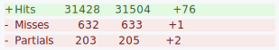
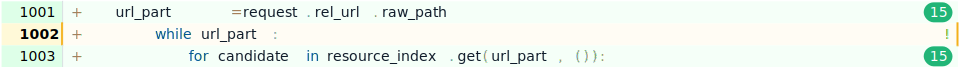
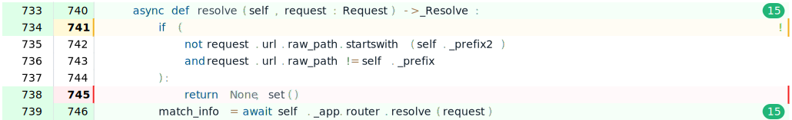

.. _aiohttp-contributing:

Contributing
============

(:doc:`contributing-admins`)

Instructions for contributors
-----------------------------

In order to make a clone of the GitHub_ repo: open the link and press the "Fork" button on the upper-right menu of the web page.

I hope everybody knows how to work with git and github nowadays :)

Workflow is pretty straightforward:

  0. Make sure you are reading the latest version of this document.
     It can be found in the GitHub_ repo in the ``docs`` subdirectory.

  1. Clone the GitHub_ repo using the ``--recurse-submodules`` argument

  2. Setup your machine with the required development environment

  3. Make a change

  4. Make sure all tests passed

  5. Add a file into the ``CHANGES`` folder (see `Changelog update`_ for how).

  6. Commit changes to your own aiohttp clone

  7. Make a pull request from the github page of your clone against the master branch

  8. Optionally make backport Pull Request(s) for landing a bug fix into released aiohttp versions.

.. note::

   The project uses *Squash-and-Merge* strategy for *GitHub Merge* button.

   Basically it means that there is **no need to rebase** a Pull Request against
   *master* branch. Just ``git merge`` *master* into your working copy (a fork) if
   needed. The Pull Request is automatically squashed into the single commit
   once the PR is accepted.

.. note::

   GitHub issue and pull request threads are automatically locked when there has
   not been any recent activity for one year.  Please open a `new issue
   <https://github.com/aio-libs/aiohttp/issues/new>`_ for related bugs.

   If you feel like there are important points in the locked discussions,
   please include those excerpts into that new issue.


Preconditions for running aiohttp test suite
--------------------------------------------

We expect you to use a python virtual environment to run our tests.

There are several ways to make a virtual environment.

If you like to use *virtualenv* please run:

.. code-block:: shell

   $ cd aiohttp
   $ virtualenv --python=`which python3` venv
   $ . venv/bin/activate

For standard python *venv*:

.. code-block:: shell

   $ cd aiohttp
   $ python3 -m venv venv
   $ . venv/bin/activate

For *virtualenvwrapper*:

.. code-block:: shell

   $ cd aiohttp
   $ mkvirtualenv --python=`which python3` aiohttp

There are other tools like *pyvenv* but you know the rule of thumb now: create a python3 virtual environment and activate it.

After that please install libraries required for development:

.. code-block:: shell

   $ make install-dev

.. note::

  For now, the development tooling depends on ``make`` and assumes an Unix OS If you wish to contribute to aiohttp from a Windows machine, the easiest way is probably to `configure the WSL <https://docs.microsoft.com/en-us/windows/wsl/install-win10>`_ so you can use the same instructions. If it's not possible for you or if it doesn't work, please contact us so we can find a solution together.

Install pre-commit hooks:

.. code-block:: shell

   $ pre-commit install

.. warning::

  If you plan to use temporary ``print()``, ``pdb`` or ``ipdb`` within the test suite, execute it with ``-s``:

  .. code-block:: shell

     $ pytest tests -s

  in order to run the tests without output capturing.

Congratulations, you are ready to run the test suite!

.. include:: ../vendor/README.rst


Run autoformatter
-----------------

The project uses black_ + isort_ formatters to keep the source code style.
Please run `make fmt` after every change before starting tests.

  .. code-block:: shell

     $ make fmt


Run aiohttp test suite
----------------------

After all the preconditions are met you can run tests typing the next
command:

.. code-block:: shell

   $ make test

The command at first will run the *linters* (sorry, we don't accept
pull requests with pyflakes, black, isort, or mypy errors).

On *lint* success the tests will be run.

Please take a look on the produced output.

Any extra texts (print statements and so on) should be removed.

.. note::

   If you see that CI build is failing on a specific Python version and
   you don't have this version on your computer, you can use the helper to
   run it (only if you have docker)::

     make test-<python-version>[-no-extensions]

   For example, if you want to run tests for python3.10
   without extensions, you can run this command::

     make test-3.10-no-extensions

Code coverage
-------------

We use *codecov.io* as an indispensable tool for analyzing our coverage
results. Visit https://codecov.io/gh/aio-libs/aiohttp to see coverage
reports for the master branch, history, pull requests etc.

We'll use an example from a real PR to demonstrate how we use this.
Once the tests run in a PR, you'll see a comment posted by *codecov*.
The most important thing to check here is whether there are any new
missed or partial lines in the report:



Here, the PR has introduced 1 miss and 2 partials. Now we
click the link in the comment header to open the full report:


Now, if we look through the diff under 'Files changed' we find one of
our partials:



In this case, the while loop is never skipped in our tests. This is
probably not worth writing a test for (and may be a situation that is
impossible to trigger anyway), so we leave this alone.

We're still missing a partial and a miss, so we switch to the
'Indirect changes' tab and take a look through the diff there. This
time we find the remaining 2 lines:



After reviewing the PR, we find that this code is no longer needed as
the changes mean that this method will never be called under those
conditions. Thanks to this report, we were able to remove some
redundant code from a performance-critical part of our codebase (this
check would have been run, probably multiple times, for every single
incoming request).

.. tip::
   Sometimes the diff on *codecov.io* doesn't make sense. This is usually
   caused by the branch being out of sync with master. Try merging
   master into the branch and it will likely fix the issue. Failing
   that, try checking coverage locally as described in the next section.

Other tools
-----------

The browser extension https://docs.codecov.io/docs/browser-extension
is also a useful tool for analyzing the coverage directly from *Files
Changed* tab on the *GitHub Pull Request* review page.


You can also produce coverage reports locally with ``make cov-dev``
or just adding ``--cov-report=html`` to ``pytest``.

This will run the test suite and collect coverage information. Once
finished, coverage results can be view by opening:
```console
$ python -m webbrowser -n file://"$(pwd)"/htmlcov/index.html
```

Documentation
-------------

We encourage documentation improvements.

Please before making a Pull Request about documentation changes run:

.. code-block:: shell

   $ make doc

Once it finishes it will output the index html page
``open file:///.../aiohttp/docs/_build/html/index.html``.

Go to the link and make sure your doc changes looks good.

Spell checking
--------------

We use ``pyenchant`` and ``sphinxcontrib-spelling`` for running spell
checker for documentation:

.. code-block:: shell

   $ make doc-spelling

Unfortunately there are problems with running spell checker on MacOS X.

To run spell checker on Linux box you should install it first:

.. code-block:: shell

   $ sudo apt-get install enchant
   $ pip install sphinxcontrib-spelling


Preparing a pull request
------------------------

When making a pull request, please include a short summary of the changes
and a reference to any issue tickets that the PR is intended to solve.
All PRs with code changes should include tests. All changes should
include a changelog entry.


Changelog update
----------------

.. include:: ../CHANGES/README.rst


Making a pull request
---------------------

After finishing all steps make a GitHub_ Pull Request with *master* base branch.


Backporting
-----------

All Pull Requests are created against *master* git branch.

If the Pull Request is not a new functionality but bug fixing
*backport* to maintenance branch would be desirable.

*aiohttp* project committer may ask for making a *backport* of the PR
into maintained branch(es), in this case he or she adds a github label
like *needs backport to 3.1*.

*Backporting* is performed *after* main PR merging into master.
 Please do the following steps:

1. Find *Pull Request's commit* for cherry-picking.

   *aiohttp* does *squashing* PRs on merging, so open your PR page on
   github and scroll down to message like ``asvetlov merged commit
   f7b8921 into master 9 days ago``.  ``f7b8921`` is the required commit number.

2. Run `cherry_picker
   <https://github.com/python/core-workflow/tree/master/cherry_picker>`_
   tool for making backport PR (the tool is already pre-installed from
   ``./requirements/dev.txt``), e.g. ``cherry_picker f7b8921 3.1``.

3. In case of conflicts fix them and continue cherry-picking by
   ``cherry_picker --continue``.

   ``cherry_picker --abort`` stops the process.

   ``cherry_picker --status`` shows current cherry-picking status
   (like ``git status``)

4. After all conflicts are done the tool opens a New Pull Request page
   in a browser with pre-filed information.  Create a backport Pull
   Request and wait for review/merging.

5. *aiohttp* *committer* should remove *backport Git label* after
   merging the backport.

How to become an aiohttp committer
----------------------------------

Contribute!

The easiest way is providing Pull Requests for issues in our bug
tracker.  But if you have a great idea for the library improvement
-- please make an issue and Pull Request.


The rules for committers are simple:

1. No wild commits! Everything should go through PRs.
2. Take a part in reviews. It's very important part of maintainer's activity.
3. Pickup issues created by others, especially if they are simple.
4. Keep test suite comprehensive. In practice it means leveling up
   coverage. 97% is not bad but we wish to have 100% someday. Well, 99%
   is good target too.
5. Don't hesitate to improve our docs. Documentation is a very important
   thing, it's the key for project success. The documentation should
   not only cover our public API but help newbies to start using the
   project and shed a light on non-obvious gotchas.


After positive answer aiohttp committer creates an issue on github
with the proposal for nomination.  If the proposal will collect only
positive votes and no strong objection -- you'll be a new member in
our team.


.. _GitHub: https://github.com/aio-libs/aiohttp

.. _ipdb: https://pypi.python.org/pypi/ipdb

.. _black: https://pypi.python.org/pypi/black

.. _isort: https://pypi.python.org/pypi/isort
